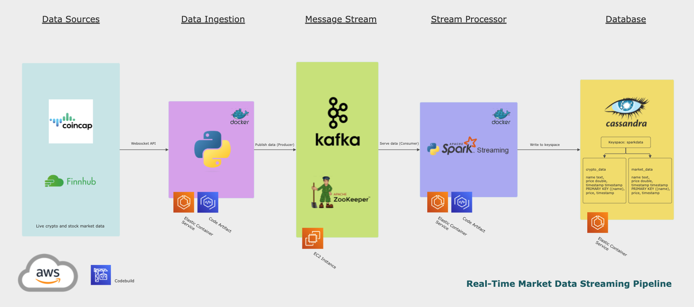

# Real-Time Market Data Streaming Pipeline

This project is a real-time data streaming pipeline using both Finnhub and CoinCap websocket API. It is designed to ingest live data into the AWS cloud platform, process and write to a final database to serve end-users.

## Architecture


## Methodology

Each individual application is build within the AWS cloud infrastructure, but can also be executed locally within docker containers if necessary.

There are 4 main steps:

### Data Ingestion
Finnhub and CoinCap data sources are connected via websocket API interface, via containerized Python application running on AWS Elastic Cloud.

### Message Stream
Event data from the data ingestion step are fed into a Kafka broker running on AWS EC2 instance.

### Stream Processor
A Spark Streaming application is connected to the Kafka topic as a consumer, and processes the raw data in json format. The data is transformed into a tabular format. The data is loaded to a Cassandra table.

### Database
Cassandra tables are used to store data sent from Spark. Cassandra allows for a high volume of writes, which is ideal for market data being ingested each second.

## Setup and Configuration Guide

## Setup Kafka server on AWS EC2

1. SSH into your EC2 machine of choice
    - Note: this project uses the AWS EC2 t2.micro, which is included in the free tier
    - There is a handy [article](https://www.linkedin.com/pulse/kafka-aws-free-tier-steven-aranibar/) to reduce Kafka memory usage for the t2.micro machine

2. Download Kafka 

```wget https://downloads.apache.org/kafka/3.5.1/kafka_2.13-3.5.1.tgz```

3. Unzip 

```tar -xvf kafka_2.13-3.5.1.tgz```

4. Install JDK 

```sudo yum install java-1.8.0-openjdk```

5. ```cd kafka_2.13-3.5.1/```

6. Do a ```sudo nano config/server.properties``` - uncomment and change ADVERTISED_LISTENERS to public ip of the EC2 instance (currently it references a local server)

7. Start Zookeeper

```bin/zookeeper-server-start.sh config/zookeeper.properties```

8. Start Kafka server

```bin/kafka-server-start.sh config/server.properties```

### Create Kafka topic

```bin/kafka-topics.sh --create --topic market_data --bootstrap-server {Public IP of the EC2 Instance:9092} --replication-factor 1 --partitions 1```

You can also test that a producer & consumer are configured correctly with the broker:

```bin/kafka-console-producer.sh --topic market_data --bootstrap-server {Public IP of the EC2 Instance:9092}```

```bin/kafka-console-consumer.sh --topic market_data --bootstrap-server {Public IP of the EC2 Instance:9092}```

## Run Docker container for Kafka producers (live market data)

This project pushes the image to AWS ECR, in order to continuously transmit data to the Kafka broker

```docker build -t market-stream-app -f producers/Dockerfile producers```

```docker run market-stream-app```

**note for Apple M1/M2 silicon, ensure the tag ```--platform=linux/amd64``` is added to the build command, as AWS ECS may error at runtime depending on the hardware being used

## Create Cassandra table and keyspace

Cassandra was installed both locally on MacOs (for testing) and on AWS EC2.

When running locally on MacOS via Homebrew, be sure to start and stop the service upon completion:

```brew services start cassandra```

```brew services stop cassandra```

The Python API for Cassandra is used to create the keyspace and table programmatically.